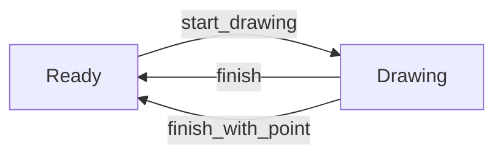
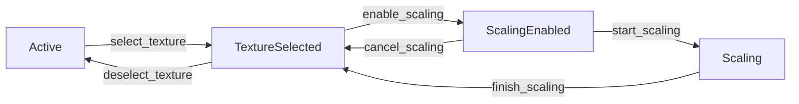

# Tool State Management System Documentation

This directory contains comprehensive documentation for the tool state management system used in the eframe-paint application.

## Overview

The tool state management system implements a type-safe finite state machine pattern for tools with:

- Pooled instance reuse
- Atomic state transitions
- Versioned state snapshots

## Documentation Files

### Core Documentation

- [Tool Transitions Guide](tool_transitions.md) - Comprehensive guide to tool state transitions
- [Performance Optimization Guide](performance_optimization.md) - Guide to optimizing performance
- [Troubleshooting Guide](troubleshooting.md) - Solutions for common issues
- [Glossary](glossary.md) - Definitions of key terms
- [Maintenance Checklist](maintenance_checklist.md) - Checklist for maintaining the system

### Source Code Documentation

The following source files contain detailed documentation:

- `src/tools/mod.rs` - Main documentation for the tool system
- `src/state.rs` - Documentation for the state management principles
- `src/error.rs` - Documentation for transition error handling

## State Transition Diagrams

### DrawStrokeTool States



### SelectionTool States



## Key Components

```
┌─────────────┐       ┌───────────────┐
│  ToolPool   │◄─────►│ EditorState   │
└─────────────┘       └───────────────┘
        ▲                   ▲
        │ 3. Retain/restore │ 2. State updates
        ▼                   ▼
┌──────────────────┐  ┌──────────────┐
│ Retained States  │  │ Active Tool  │
└──────────────────┘  └──────────────┘
```

## Getting Started

To understand the tool state management system:

1. Start with the [Glossary](glossary.md) to understand key terms
2. Read the [Tool Transitions Guide](tool_transitions.md) for an overview of state transitions
3. Explore the source code documentation for implementation details
4. Refer to the [Troubleshooting Guide](troubleshooting.md) for common issues

## Contributing

When contributing to the tool state management system:

1. Follow the [Maintenance Checklist](maintenance_checklist.md)
2. Ensure all transitions are properly validated
3. Update documentation when adding new tools or states
4. Add tests for all new transitions

## Best Practices

1. Always use the tool pool for tool transitions
2. Validate transitions before attempting them
3. Handle all error cases explicitly
4. Use the builder pattern for complex state updates
5. Check version numbers for efficient change detection
