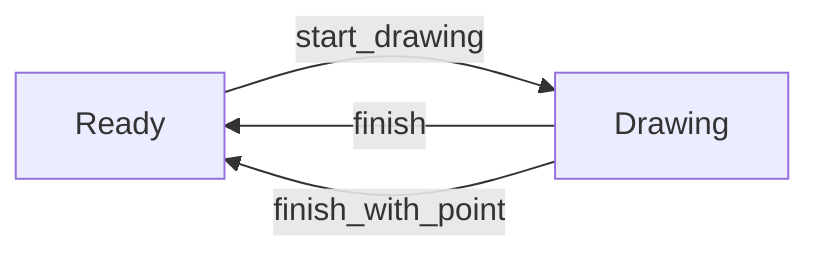
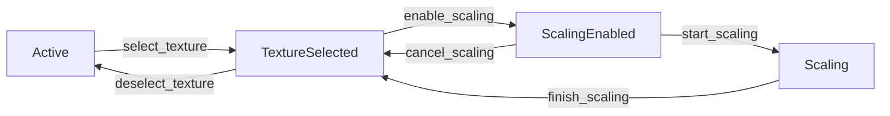

# Tool State Transitions Guide

This document provides a comprehensive guide to the tool state transition system in the eframe-paint application.

## State Machine Architecture

The tool system implements a type-safe finite state machine pattern where:

1. Each tool has multiple possible states (e.g., `Ready`, `Drawing`, `Active`, `Scaling`)
2. Transitions between states are explicitly defined and type-checked
3. Invalid transitions are prevented at compile time
4. Runtime validation ensures transitions are safe

## Valid Transition Patterns

### DrawStrokeTool Transitions



### SelectionTool Transitions



## Code Examples

### Basic Transition Pattern

```rust
// Type-safe transition with error handling
match ready_tool.start_drawing(pos) {
    Ok(drawing_tool) => {
        // Transition succeeded
        // drawing_tool is now a DrawStrokeTool<Drawing>
    },
    Err(original_tool) => {
        // Transition failed
        // original_tool is still a DrawStrokeTool<Ready>
    }
}
```

### Complete Drawing Workflow

```rust
// 1. Get a drawing tool from the pool
let mut tool = tool_pool.get("DrawStroke")
    .unwrap_or_else(|| ToolType::DrawStroke(new_draw_stroke_tool()));

// 2. Start drawing (transition from Ready to Drawing)
if let ToolType::DrawStroke(ready_tool) = tool {
    match ready_tool.start_drawing(start_pos) {
        Ok(drawing_tool) => {
            // 3. Update tool reference with new state
            tool = ToolType::DrawStroke(DrawStrokeToolType::Drawing(drawing_tool));

            // 4. Add points while drawing
            if let ToolType::DrawStroke(DrawStrokeToolType::Drawing(ref mut drawing)) = tool {
                drawing.add_point(next_pos);
            }

            // 5. Finish drawing (transition from Drawing back to Ready)
            if let ToolType::DrawStroke(DrawStrokeToolType::Drawing(drawing_tool)) = tool {
                match drawing_tool.finish() {
                    Ok((command, ready_tool)) => {
                        // 6. Execute the command and update tool reference
                        execute_command(command);
                        tool = ToolType::DrawStroke(DrawStrokeToolType::Ready(ready_tool));
                    },
                    Err(drawing_tool) => {
                        // Handle error case
                        tool = ToolType::DrawStroke(DrawStrokeToolType::Drawing(drawing_tool));
                    }
                }
            }
        },
        Err(ready_tool) => {
            // Handle transition failure
            tool = ToolType::DrawStroke(DrawStrokeToolType::Ready(ready_tool));
        }
    }
}

// 7. Return tool to pool
tool_pool.return_tool(tool);
```

### Selection Tool Workflow

```rust
// 1. Get a selection tool from the pool
let mut tool = tool_pool.get("Selection")
    .unwrap_or_else(|| ToolType::Selection(new_selection_tool()));

// 2. Select a texture (transition from Active to TextureSelected)
if let ToolType::Selection(SelectionToolType::Active(active_tool)) = tool {
    match active_tool.select_texture() {
        Ok(texture_tool) => {
            // 3. Update tool reference with new state
            tool = ToolType::Selection(SelectionToolType::TextureSelected(texture_tool));

            // 4. Enable scaling (transition from TextureSelected to ScalingEnabled)
            if let ToolType::Selection(SelectionToolType::TextureSelected(texture_tool)) = tool {
                match texture_tool.enable_scaling() {
                    Ok(scaling_enabled_tool) => {
                        // 5. Update tool reference with new state
                        tool = ToolType::Selection(SelectionToolType::ScalingEnabled(scaling_enabled_tool));

                        // 6. Start scaling (transition from ScalingEnabled to Scaling)
                        if let ToolType::Selection(SelectionToolType::ScalingEnabled(scaling_enabled)) = tool {
                            match scaling_enabled.start_scaling() {
                                Ok(scaling_tool) => {
                                    // 7. Update tool reference with new state
                                    tool = ToolType::Selection(SelectionToolType::Scaling(scaling_tool));

                                    // 8. Finish scaling (transition from Scaling to TextureSelected)
                                    if let ToolType::Selection(SelectionToolType::Scaling(scaling)) = tool {
                                        match scaling.finish_scaling() {
                                            Ok(texture_tool) => {
                                                // 9. Update tool reference with new state
                                                tool = ToolType::Selection(SelectionToolType::TextureSelected(texture_tool));
                                            },
                                            Err(scaling) => {
                                                // Handle error case
                                                tool = ToolType::Selection(SelectionToolType::Scaling(scaling));
                                            }
                                        }
                                    }
                                },
                                Err(scaling_enabled) => {
                                    // Handle error case
                                    tool = ToolType::Selection(SelectionToolType::ScalingEnabled(scaling_enabled));
                                }
                            }
                        }
                    },
                    Err(texture_tool) => {
                        // Handle error case
                        tool = ToolType::Selection(SelectionToolType::TextureSelected(texture_tool));
                    }
                }
            }
        },
        Err(active_tool) => {
            // Handle transition failure
            tool = ToolType::Selection(SelectionToolType::Active(active_tool));
        }
    }
}

// 10. Return tool to pool
tool_pool.return_tool(tool);
```

## Validation Rules

Transitions are validated based on:

1. **Current State**: Some transitions are only valid from specific states
2. **Tool Busy Status**: Tools with active operations cannot transition
3. **Selection Status**: Some transitions require elements to be selected
4. **Memory Safety**: Transitions must not violate memory safety constraints

## Common Transition Errors

| Error                    | Cause                                                | Solution                         |
| ------------------------ | ---------------------------------------------------- | -------------------------------- |
| `InvalidStateTransition` | Attempting to transition between incompatible states | Check state before transitioning |
| `ToolBusy`               | Tool is currently performing an operation            | Wait for operation to complete   |
| `MemorySafetyViolation`  | Transition would violate memory safety               | Reset to a known good state      |

## Best Practices

1. **Validate Before Transitioning**: Always check `can_transition()` before attempting a transition
2. **Handle All Error Cases**: Explicitly handle all possible transition errors
3. **Use Type System**: Let Rust's type system enforce valid transitions
4. **Pool Tools**: Use the tool pool to avoid unnecessary allocations
5. **Retain State**: Use state retention to preserve tool configuration

## Debugging Transitions

When debugging transition issues:

1. Check the current state name with `tool.current_state_name()`
2. Verify transition validity with `tool_pool.can_transition(&tool)`
3. Inspect pending operations with `tool.has_pending_operations()`
4. Check for active transforms with `tool.has_active_transform()`

## Performance Considerations

- Tool pooling reduces allocations during transitions
- State retention preserves tool configuration between activations
- Type-safe transitions prevent runtime errors and invalid states
- Versioned state tracking enables efficient change detection
